# Design Document

## Overview

The Pomodoro Productivity App will be a **modern, comprehensive productivity suite** that goes far beyond basic timing. It combines the Pomodoro Technique with advanced productivity features including AI-powered insights, habit tracking, goal management, team collaboration, and intelligent scheduling. Built as a full-stack web application using a **monorepo structure** with separate backend and frontend directories.

### Repository Structure Decision

**Recommended Structure: Monorepo**
```
pomodoro-productivity-app/
├── backend/          # NestJS API server
├── frontend/         # React/Vue web client  
├── shared/           # Shared types and utilities
├── docs/             # Documentation
└── docker-compose.yml # Local development setup
```

**Rationale:**
- Single repository simplifies dependency management and versioning
- Shared TypeScript interfaces between frontend and backend
- Unified CI/CD pipeline and deployment
- Better for learning full-stack development
- Easier to maintain consistency across the stack

## Architecture

### System Architecture

```mermaid
graph TB
    subgraph "Frontend (Next.js)"
        Dashboard[Modern Dashboard]
        Timer[Smart Timer]
        Tasks[Task Management]
        Goals[Goal Tracking]
        Habits[Habit Tracker]
        Analytics[AI Analytics]
        Collab[Team Collaboration]
        Calendar[Smart Calendar]
        Focus[Focus Modes]
    end
    
    subgraph "Backend (NestJS)"
        API[GraphQL/REST API]
        AuthService[Auth Service]
        TimerService[Smart Timer Service]
        TaskService[Task Service]
        GoalService[Goal Service]
        HabitService[Habit Service]
        AIService[AI Insights Service]
        CollabService[Collaboration Service]
        CalendarService[Calendar Integration]
        NotificationService[Smart Notifications]
        SchedulingService[Intelligent Scheduling]
    end
    
    subgraph "Data Layer"
        DB[(PostgreSQL Database)]
        Redis[(Redis Cache)]
        Vector[(Vector DB for AI)]
    end
    
    subgraph "External Services"
        Email[Email Service]
        Push[Push Notifications]
        Calendar_API[Calendar APIs]
        AI_API[OpenAI/Claude API]
        Analytics_API[Analytics Services]
    end
    
    Dashboard --> API
    Timer --> TimerService
    Tasks --> TaskService
    Goals --> GoalService
    Habits --> HabitService
    Analytics --> AIService
    Collab --> CollabService
    Calendar --> CalendarService
    
    TimerService --> Redis
    TaskService --> DB
    GoalService --> DB
    HabitService --> DB
    AIService --> Vector
    CollabService --> DB
    NotificationService --> Email
    NotificationService --> Push
    CalendarService --> Calendar_API
    AIService --> AI_API
```



### Technology Stack

**Backend (NestJS)**
- **Framework:** NestJS with TypeScript
- **Database:** PostgreSQL with TypeORM
- **Cache:** Redis for session management and real-time timer state
- **Authentication:** JWT with Passport.js
- **Validation:** class-validator and class-transformer
- **Documentation:** Swagger/OpenAPI

**Frontend**
- **Framework:** Next.js 14 with React and TypeScript (modern full-stack)
- **State Management:** Zustand with persistence
- **UI Library:** Shadcn/ui with Tailwind CSS (modern, customizable)
- **Animations:** Framer Motion for smooth interactions
- **Charts:** Recharts for analytics visualization
- **HTTP Client:** TanStack Query (React Query) for caching
- **Real-time:** Socket.io client for live collaboration
- **PWA:** Service workers for offline functionality
- **Notifications:** Web Push API for browser notifications

**Shared**
- **Types:** Shared TypeScript interfaces and DTOs
- **Utilities:** Common validation and formatting functions

## Components and Interfaces

### Core Modules

#### 1. Authentication Module
```typescript
// Interfaces
interface User {
  id: string;
  email: string;
  username: string;
  createdAt: Date;
  preferences: UserPreferences;
}

interface UserPreferences {
  workDuration: number;      // minutes
  shortBreakDuration: number;
  longBreakDuration: number;
  notificationSound: string;
  notificationVolume: number;
  emailNotifications: boolean;
}
```

#### 2. Timer Module
```typescript
interface PomodoroSession {
  id: string;
  userId: string;
  taskId?: string;
  type: 'work' | 'short_break' | 'long_break';
  duration: number;
  startTime: Date;
  endTime?: Date;
  completed: boolean;
  paused: boolean;
  pausedDuration: number;
}

interface TimerState {
  sessionId: string;
  isActive: boolean;
  isPaused: boolean;
  timeRemaining: number;
  currentType: SessionType;
  completedPomodoros: number;
}
```

#### 3. Task Management Module
```typescript
interface Task {
  id: string;
  userId: string;
  title: string;
  description?: string;
  category: string;
  estimatedPomodoros: number;
  completedPomodoros: number;
  completed: boolean;
  createdAt: Date;
  completedAt?: Date;
}

interface Category {
  id: string;
  userId: string;
  name: string;
  color: string;
}
```

#### 4. Goal Management Module
```typescript
interface Goal {
  id: string;
  userId: string;
  title: string;
  description: string;
  type: 'daily' | 'weekly' | 'monthly' | 'yearly' | 'custom';
  targetValue: number;
  currentValue: number;
  unit: string; // 'pomodoros', 'hours', 'tasks', 'habits'
  deadline?: Date;
  priority: 'low' | 'medium' | 'high';
  status: 'active' | 'completed' | 'paused' | 'failed';
  linkedTasks: string[];
  linkedHabits: string[];
}

interface Milestone {
  id: string;
  goalId: string;
  title: string;
  targetValue: number;
  completed: boolean;
  completedAt?: Date;
}
```

#### 5. Habit Tracking Module
```typescript
interface Habit {
  id: string;
  userId: string;
  name: string;
  description?: string;
  frequency: 'daily' | 'weekly' | 'custom';
  targetCount: number;
  category: string;
  color: string;
  streak: number;
  longestStreak: number;
  createdAt: Date;
  isActive: boolean;
}

interface HabitEntry {
  id: string;
  habitId: string;
  date: Date;
  completed: boolean;
  count: number;
  notes?: string;
}
```

#### 6. AI Analytics Module
```typescript
interface AIInsight {
  id: string;
  userId: string;
  type: 'productivity_pattern' | 'focus_recommendation' | 'goal_suggestion' | 'habit_insight';
  title: string;
  description: string;
  confidence: number;
  actionable: boolean;
  actions: string[];
  createdAt: Date;
  dismissed: boolean;
}

interface ProductivityStats {
  userId: string;
  date: Date;
  completedPomodoros: number;
  totalFocusTime: number;
  averageSessionLength: number;
  tasksCompleted: number;
  breakAdherence: number;
  focusScore: number; // AI-calculated 0-100
  productivityTrend: 'improving' | 'declining' | 'stable';
  peakHours: number[];
  distractionEvents: number;
}

interface SmartReport {
  weekStart: Date;
  totalPomodoros: number;
  totalFocusTime: number;
  mostProductiveDay: string;
  taskCompletionRate: number;
  habitConsistency: number;
  goalProgress: number;
  aiInsights: AIInsight[];
  recommendations: string[];
  trends: TrendData[];
  focusQuality: number;
}
```

#### 7. Team Collaboration Module
```typescript
interface Team {
  id: string;
  name: string;
  description?: string;
  ownerId: string;
  members: TeamMember[];
  settings: TeamSettings;
  createdAt: Date;
}

interface TeamMember {
  userId: string;
  role: 'owner' | 'admin' | 'member';
  joinedAt: Date;
  permissions: string[];
}

interface SharedSession {
  id: string;
  teamId: string;
  name: string;
  type: 'focus_room' | 'study_group' | 'work_sprint';
  participants: string[];
  startTime: Date;
  duration: number;
  isActive: boolean;
}
```

#### 8. Smart Calendar Integration
```typescript
interface CalendarEvent {
  id: string;
  userId: string;
  title: string;
  type: 'pomodoro_block' | 'meeting' | 'deep_work' | 'break';
  startTime: Date;
  endTime: Date;
  taskIds: string[];
  autoScheduled: boolean;
  source: 'manual' | 'ai_suggested' | 'external_calendar';
}

interface FocusMode {
  id: string;
  userId: string;
  name: string;
  description: string;
  settings: {
    blockWebsites: string[];
    allowedApps: string[];
    notificationLevel: 'none' | 'urgent' | 'all';
    backgroundMusic?: string;
    ambientSounds?: string;
  };
  isActive: boolean;
}
```

### API Endpoints

#### Authentication
- `POST /auth/register` - User registration
- `POST /auth/login` - User login
- `POST /auth/logout` - User logout
- `GET /auth/profile` - Get user profile
- `PUT /auth/profile` - Update user profile
- `PUT /auth/preferences` - Update user preferences

#### Timer Management
- `POST /timer/start` - Start new Pomodoro session
- `PUT /timer/pause` - Pause current session
- `PUT /timer/resume` - Resume paused session
- `PUT /timer/complete` - Mark session as completed
- `GET /timer/current` - Get current timer state
- `GET /timer/history` - Get session history

#### Task Management
- `GET /tasks` - Get user tasks
- `POST /tasks` - Create new task
- `PUT /tasks/:id` - Update task
- `DELETE /tasks/:id` - Delete task
- `GET /categories` - Get user categories
- `POST /categories` - Create category

#### Goals & Habits
- `GET /goals` - Get user goals
- `POST /goals` - Create new goal
- `PUT /goals/:id` - Update goal
- `DELETE /goals/:id` - Delete goal
- `POST /goals/:id/milestones` - Add milestone
- `GET /habits` - Get user habits
- `POST /habits` - Create new habit
- `PUT /habits/:id` - Update habit
- `POST /habits/:id/entries` - Log habit entry
- `GET /habits/:id/streak` - Get habit streak data

#### AI Analytics & Insights
- `GET /analytics/dashboard` - Get AI-powered dashboard
- `GET /analytics/insights` - Get personalized AI insights
- `GET /analytics/reports/smart` - Get AI-generated reports
- `POST /analytics/feedback` - Provide feedback on insights
- `GET /analytics/predictions` - Get productivity predictions
- `GET /analytics/focus-score` - Get focus quality metrics

#### Team Collaboration
- `GET /teams` - Get user teams
- `POST /teams` - Create new team
- `PUT /teams/:id` - Update team
- `POST /teams/:id/invite` - Invite team member
- `GET /teams/:id/sessions` - Get team sessions
- `POST /teams/:id/sessions` - Start shared session
- `PUT /sessions/:id/join` - Join shared session

#### Smart Calendar
- `GET /calendar/events` - Get calendar events
- `POST /calendar/schedule` - AI-powered scheduling
- `GET /calendar/suggestions` - Get scheduling suggestions
- `POST /calendar/sync` - Sync external calendars
- `GET /focus-modes` - Get focus modes
- `POST /focus-modes` - Create focus mode
- `PUT /focus-modes/:id/activate` - Activate focus mode

## Data Models

### Database Schema

```sql
-- Users table
CREATE TABLE users (
  id UUID PRIMARY KEY DEFAULT gen_random_uuid(),
  email VARCHAR(255) UNIQUE NOT NULL,
  username VARCHAR(100) NOT NULL,
  password_hash VARCHAR(255) NOT NULL,
  created_at TIMESTAMP DEFAULT NOW(),
  updated_at TIMESTAMP DEFAULT NOW()
);

-- User preferences
CREATE TABLE user_preferences (
  user_id UUID PRIMARY KEY REFERENCES users(id),
  work_duration INTEGER DEFAULT 25,
  short_break_duration INTEGER DEFAULT 5,
  long_break_duration INTEGER DEFAULT 15,
  notification_sound VARCHAR(100) DEFAULT 'bell',
  notification_volume INTEGER DEFAULT 50,
  email_notifications BOOLEAN DEFAULT true
);

-- Categories
CREATE TABLE categories (
  id UUID PRIMARY KEY DEFAULT gen_random_uuid(),
  user_id UUID REFERENCES users(id),
  name VARCHAR(100) NOT NULL,
  color VARCHAR(7) DEFAULT '#3498db',
  created_at TIMESTAMP DEFAULT NOW()
);

-- Tasks
CREATE TABLE tasks (
  id UUID PRIMARY KEY DEFAULT gen_random_uuid(),
  user_id UUID REFERENCES users(id),
  category_id UUID REFERENCES categories(id),
  title VARCHAR(255) NOT NULL,
  description TEXT,
  estimated_pomodoros INTEGER DEFAULT 1,
  completed_pomodoros INTEGER DEFAULT 0,
  completed BOOLEAN DEFAULT false,
  created_at TIMESTAMP DEFAULT NOW(),
  completed_at TIMESTAMP
);

-- Pomodoro sessions
CREATE TABLE pomodoro_sessions (
  id UUID PRIMARY KEY DEFAULT gen_random_uuid(),
  user_id UUID REFERENCES users(id),
  task_id UUID REFERENCES tasks(id),
  type VARCHAR(20) NOT NULL CHECK (type IN ('work', 'short_break', 'long_break')),
  duration INTEGER NOT NULL,
  start_time TIMESTAMP NOT NULL,
  end_time TIMESTAMP,
  completed BOOLEAN DEFAULT false,
  paused_duration INTEGER DEFAULT 0
);

-- Goals
CREATE TABLE goals (
  id UUID PRIMARY KEY DEFAULT gen_random_uuid(),
  user_id UUID REFERENCES users(id),
  title VARCHAR(255) NOT NULL,
  description TEXT,
  type VARCHAR(20) NOT NULL,
  target_value INTEGER NOT NULL,
  current_value INTEGER DEFAULT 0,
  unit VARCHAR(50) NOT NULL,
  deadline TIMESTAMP,
  priority VARCHAR(10) DEFAULT 'medium',
  status VARCHAR(20) DEFAULT 'active',
  created_at TIMESTAMP DEFAULT NOW()
);

-- Habits
CREATE TABLE habits (
  id UUID PRIMARY KEY DEFAULT gen_random_uuid(),
  user_id UUID REFERENCES users(id),
  name VARCHAR(255) NOT NULL,
  description TEXT,
  frequency VARCHAR(20) NOT NULL,
  target_count INTEGER DEFAULT 1,
  category VARCHAR(100),
  color VARCHAR(7) DEFAULT '#3498db',
  streak INTEGER DEFAULT 0,
  longest_streak INTEGER DEFAULT 0,
  is_active BOOLEAN DEFAULT true,
  created_at TIMESTAMP DEFAULT NOW()
);

-- Habit entries
CREATE TABLE habit_entries (
  id UUID PRIMARY KEY DEFAULT gen_random_uuid(),
  habit_id UUID REFERENCES habits(id),
  date DATE NOT NULL,
  completed BOOLEAN DEFAULT false,
  count INTEGER DEFAULT 0,
  notes TEXT,
  PRIMARY KEY (habit_id, date)
);

-- Teams
CREATE TABLE teams (
  id UUID PRIMARY KEY DEFAULT gen_random_uuid(),
  name VARCHAR(255) NOT NULL,
  description TEXT,
  owner_id UUID REFERENCES users(id),
  settings JSONB DEFAULT '{}',
  created_at TIMESTAMP DEFAULT NOW()
);

-- Team members
CREATE TABLE team_members (
  team_id UUID REFERENCES teams(id),
  user_id UUID REFERENCES users(id),
  role VARCHAR(20) DEFAULT 'member',
  permissions JSONB DEFAULT '[]',
  joined_at TIMESTAMP DEFAULT NOW(),
  PRIMARY KEY (team_id, user_id)
);

-- Focus modes
CREATE TABLE focus_modes (
  id UUID PRIMARY KEY DEFAULT gen_random_uuid(),
  user_id UUID REFERENCES users(id),
  name VARCHAR(255) NOT NULL,
  description TEXT,
  settings JSONB NOT NULL,
  is_active BOOLEAN DEFAULT false,
  created_at TIMESTAMP DEFAULT NOW()
);

-- AI insights
CREATE TABLE ai_insights (
  id UUID PRIMARY KEY DEFAULT gen_random_uuid(),
  user_id UUID REFERENCES users(id),
  type VARCHAR(50) NOT NULL,
  title VARCHAR(255) NOT NULL,
  description TEXT NOT NULL,
  confidence DECIMAL(3,2) NOT NULL,
  actionable BOOLEAN DEFAULT false,
  actions JSONB DEFAULT '[]',
  dismissed BOOLEAN DEFAULT false,
  created_at TIMESTAMP DEFAULT NOW()
);

-- Enhanced daily statistics
CREATE TABLE daily_stats (
  user_id UUID REFERENCES users(id),
  date DATE,
  completed_pomodoros INTEGER DEFAULT 0,
  total_focus_time INTEGER DEFAULT 0,
  tasks_completed INTEGER DEFAULT 0,
  habits_completed INTEGER DEFAULT 0,
  break_adherence DECIMAL(3,2) DEFAULT 0,
  focus_score INTEGER DEFAULT 0,
  distraction_events INTEGER DEFAULT 0,
  peak_hours INTEGER[] DEFAULT '{}',
  PRIMARY KEY (user_id, date)
);
```

### Redis Schema

```typescript
// Timer state cache
interface CachedTimerState {
  userId: string;
  sessionId: string;
  startTime: number;
  duration: number;
  isPaused: boolean;
  pausedAt?: number;
  totalPausedTime: number;
}

// Redis keys
const TIMER_KEY = `timer:${userId}`;
const SESSION_KEY = `session:${sessionId}`;
```

## Error Handling

### Error Response Format
```typescript
interface ErrorResponse {
  statusCode: number;
  message: string;
  error: string;
  timestamp: string;
  path: string;
}
```

### Common Error Scenarios
- **Authentication Errors:** Invalid credentials, expired tokens
- **Validation Errors:** Invalid input data, missing required fields
- **Business Logic Errors:** Timer conflicts, invalid session states
- **Database Errors:** Connection issues, constraint violations
- **Rate Limiting:** Too many requests from single user

### Error Handling Strategy
- Global exception filter in NestJS
- Structured error logging with Winston
- User-friendly error messages in frontend
- Retry mechanisms for transient failures
- Graceful degradation for non-critical features

## Testing Strategy

### Backend Testing
- **Unit Tests:** Service layer logic, utility functions
- **Integration Tests:** API endpoints, database operations
- **E2E Tests:** Complete user workflows
- **Performance Tests:** Timer accuracy, concurrent users

### Frontend Testing
- **Component Tests:** React component rendering and behavior
- **Integration Tests:** API integration, state management
- **E2E Tests:** User journeys with Cypress
- **Accessibility Tests:** WCAG compliance

### Test Data Management
- Factory pattern for test data generation
- Database seeding for consistent test environments
- Mock services for external dependencies
- Isolated test databases

## Security Considerations

### Authentication & Authorization
- JWT tokens with short expiration times
- Refresh token rotation
- Password hashing with bcrypt
- Rate limiting on authentication endpoints

### Data Protection
- Input validation and sanitization
- SQL injection prevention with TypeORM
- XSS protection with Content Security Policy
- CORS configuration for frontend domain

### Privacy
- User data encryption at rest
- Secure session management
- Data retention policies
- GDPR compliance for EU users

## Performance Optimization

### Backend Performance
- Database indexing on frequently queried fields
- Redis caching for timer states and user sessions
- Connection pooling for database connections
- Async processing for analytics calculations

### Frontend Performance
- Code splitting and lazy loading
- Memoization for expensive calculations
- Optimistic updates for better UX
- Service worker for offline functionality

### Real-time Features
- WebSocket connections for timer synchronization
- Efficient event broadcasting
- Connection management and reconnection logic
- Fallback to polling for unreliable connections
#
# Modern Features Beyond Basic Timer

### 1. AI-Powered Productivity Insights
- **Smart Analytics:** Machine learning algorithms analyze work patterns to provide personalized insights
- **Predictive Scheduling:** AI suggests optimal times for different types of work based on historical performance
- **Focus Quality Scoring:** Advanced metrics beyond just time tracking to measure actual productivity
- **Intelligent Recommendations:** Personalized suggestions for improving work habits and achieving goals

### 2. Advanced Goal & Habit Management
- **SMART Goals Integration:** Structured goal setting with automatic progress tracking
- **Habit Stacking:** Link related habits and goals for compound productivity improvements
- **Milestone Celebrations:** Gamified achievement system with visual progress indicators
- **Adaptive Targets:** Goals that automatically adjust based on performance and life changes

### 3. Team Collaboration & Social Features
- **Virtual Focus Rooms:** Shared Pomodoro sessions with team members
- **Productivity Challenges:** Friendly competition and accountability features
- **Team Analytics:** Aggregate insights for team productivity optimization
- **Async Collaboration:** Coordinate work sessions across time zones

### 4. Smart Calendar Integration
- **Intelligent Scheduling:** AI-powered calendar optimization for deep work blocks
- **Context Switching Minimization:** Automatic grouping of similar tasks
- **Energy-Based Scheduling:** Schedule tasks based on personal energy patterns
- **Meeting-Free Zones:** Automatic protection of focus time

### 5. Advanced Focus Management
- **Adaptive Focus Modes:** Different environments for different types of work
- **Distraction Blocking:** Smart website and app blocking based on current task
- **Ambient Soundscapes:** Curated audio environments for optimal focus
- **Biometric Integration:** Optional heart rate and stress monitoring for focus optimization

### 6. Modern UX/UI Features
- **Dark/Light Mode:** Automatic theme switching based on time of day
- **Customizable Dashboards:** Drag-and-drop widgets for personalized views
- **Progressive Web App:** Full offline functionality with sync when online
- **Voice Commands:** Hands-free timer control and task management
- **Gesture Controls:** Swipe and tap shortcuts for common actions

### 7. Data & Privacy
- **End-to-End Encryption:** All personal data encrypted at rest and in transit
- **Data Portability:** Easy export in multiple formats (JSON, CSV, PDF reports)
- **Privacy Controls:** Granular control over what data is shared and with whom
- **GDPR Compliance:** Full compliance with international privacy regulations

### 8. Integration Ecosystem
- **Calendar Sync:** Two-way sync with Google Calendar, Outlook, Apple Calendar
- **Task Management:** Integration with Todoist, Notion, Trello, Asana
- **Time Tracking:** Export to Toggl, RescueTime, Clockify
- **Health Apps:** Integration with Apple Health, Google Fit for holistic wellness
- **Slack/Discord Bots:** Status updates and team coordination

### 9. Advanced Analytics & Reporting
- **Burnout Prevention:** Early warning system for overwork patterns
- **Productivity Forecasting:** Predict future performance based on current trends
- **Custom Metrics:** Define and track personalized productivity indicators
- **Executive Dashboards:** High-level summaries for managers and team leads
- **Comparative Analytics:** Benchmark against anonymized peer groups

### 10. Accessibility & Inclusivity
- **Full Screen Reader Support:** Complete WCAG 2.1 AA compliance
- **Keyboard Navigation:** Full app functionality without mouse
- **High Contrast Modes:** Multiple accessibility themes
- **Cognitive Load Reduction:** Simplified interfaces for users with ADHD/autism
- **Multi-language Support:** Localization for global user base